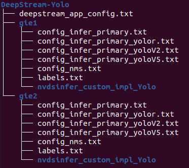

# How to use multiple YOLO GIEs on DeepStream

**NOTE**: The `deepstream-app` does not support multiple primary GIEs. You can only use one YOLO model as primary GIE and the other YOLO models as secondary GIEs (infering the primary detected object). To use 2 or more YOLO models as primary GIE, you need to use a custom code.

* [Directory tree](#directory-tree)
* [Change the YoloLayer plugin version](#change-the-yololayer-plugin-version)
* [Compile the libs](#compile-the-libs)
* [Edit the config_infer_primary files](#edit-the-config_infer_primary-files)
* [Edit the deepstream_app_config file](#edit-the-deepstream_app_config-file)
* [Test](#test)

##

### Directory tree

#### 1. Download the repo

```
git clone https://github.com/marcoslucianops/DeepStream-Yolo.git
cd DeepStream-Yolo
```

#### 2. Create folders for the GIEs and copy the DeepStream-Yolo files to them



#### 3. Copy the class names file to each GIE folder and remane it to `labels.txt`

#### 4. Copy the `onnx` or `cfg` and `weights` files to each GIE folder

##

### Change the YoloLayer plugin version

Edit the `yoloPlugins.h` file (line 53), in each GIE `nvdsinfer_custom_impl_Yolo` folder.

```
const char* YOLOLAYER_PLUGIN_VERSION {"1"};
```
To:
```
const char* YOLOLAYER_PLUGIN_VERSION {"2"};
```

**NOTE**: `gie2`: version = 2 / `gie3`: version = 3 / `gie4`: version = 4.

##

### Compile the libs

**NOTE**: Do it for each GIE folder, replacing the GIE folder name (`gie1/nvdsinfer_custom_impl_Yolo`).

* DeepStream 6.3 on x86 platform

  ```
  CUDA_VER=12.1 make -C gie1/nvdsinfer_custom_impl_Yolo
  ```

* DeepStream 6.2 on x86 platform

  ```
  CUDA_VER=11.8 make -C gie1/nvdsinfer_custom_impl_Yolo
  ```

* DeepStream 6.1.1 on x86 platform

  ```
  CUDA_VER=11.7 make -C gie1/nvdsinfer_custom_impl_Yolo
  ```

* DeepStream 6.1 on x86 platform

  ```
  CUDA_VER=11.6 make -C gie1/nvdsinfer_custom_impl_Yolo
  ```

* DeepStream 6.0.1 / 6.0 on x86 platform

  ```
  CUDA_VER=11.4 make -C gie1/nvdsinfer_custom_impl_Yolo
  ```

* DeepStream 6.3 / 6.2 / 6.1.1 / 6.1 on Jetson platform

  ```
  CUDA_VER=11.4 make -C gie1/nvdsinfer_custom_impl_Yolo
  ```

* DeepStream 6.0.1 / 6.0 on Jetson platform

  ```
  CUDA_VER=10.2 make -C gie1/nvdsinfer_custom_impl_Yolo
  ```

##

### Edit the config_infer_primary files

**NOTE**: Edit the files according to the model you will use (YOLOv8, YOLOv5, YOLOv4, etc).

**NOTE**: Do it for each GIE folder.

* Edit the path of the `cfg` file

  Example for gie1 (Darknet YOLO)

  ```
  custom-network-config=gie1/yolo.cfg
  model-file=yolo.weights
  ```

  Example for gie2 (Darknet YOLO)

  ```
  custom-network-config=gie2/yolo.cfg
  model-file=yolo.weights
  ```

  Example for gie1 (ONNX)

  ```
  onnx-file=yolo.onnx
  ```

  Example for gie2 (ONNX)

  ```
  onnx-file=yolo.onnx
  ```

* Edit the gie-unique-id

  Example for gie1

  ```
  gie-unique-id=1
  ```

  Example for gie2

  ```
  gie-unique-id=2
  ```

* Edit the process-mode

  Example for primary inference engine

  ```
  process-mode=1
  ```

  Example for secondary inference engine (infering the primary detected object)

  ```
  process-mode=2
  ```

  **NOTE**: In the secondary inference, we need to set which gie it will use to operate

  Add
  ```
  operate-on-gie-id=1
  ```

  To operate on specific class ids

  ```
  operate-on-class-ids=0;1;2
  ```

* Edit batch-size

  Example for primary inference engine

  ```
  batch-size=1
  ```

  Example for secondary inference engine (infering the primary detected object)

  ```
  batch-size=16
  ```

### Edit the deepstream_app_config file

**NOTE**: Add the `secondary-gie` key after `primary-gie` key.

Example for 1 `secondary-gie` (2 inferences):

```
[secondary-gie0]
enable=1
gpu-id=0
gie-unique-id=2
operate-on-gie-id=1
operate-on-class-ids=0
nvbuf-memory-type=0
config-file=gie2/config_infer_primary.txt
```

Example for 2 `secondary-gie` (3 inferences):
```
[secondary-gie0]
enable=1
gpu-id=0
gie-unique-id=2
operate-on-gie-id=1
operate-on-class-ids=0
nvbuf-memory-type=0
config-file=gie2/config_infer_primary.txt

[secondary-gie1]
enable=1
gpu-id=0
gie-unique-id=3
operate-on-gie-id=1
operate-on-class-ids=0
nvbuf-memory-type=0
config-file=gie3/config_infer_primary.txt
```

**NOTE**: Remember to edit `primary-gie` key

```
[primary-gie]
enable=1
gpu-id=0
gie-unique-id=1
nvbuf-memory-type=0
config-file=config_infer_primary.txt
```

To
```
[primary-gie]
enable=1
gpu-id=0
gie-unique-id=1
nvbuf-memory-type=0
config-file=gie1/config_infer_primary.txt
```

##

### Test

```
deepstream-app -c deepstream_app_config.txt
```

**NOTE**: During test process, the engine files will be generated in the DeepStream-Yolo folder. When build process is done, for each GIE, move engine file to its respective folder (`gie1`, `gie2`, etc).
